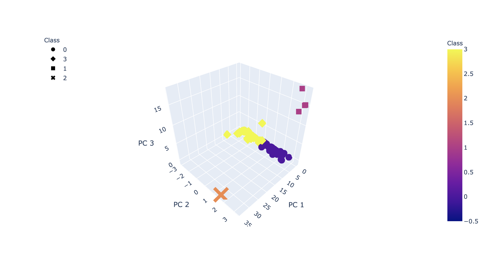
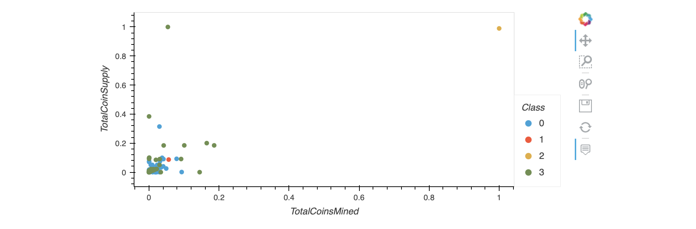

# Cryptocurrencies

## Resources
* Python 3.9.0, 
* Anaconda Navigator 1.9.12,
* Jupyter notebook 6.0.3,
* Pandas, Sklearn.

## Overview
the purpose of this analysis is to help an Investment firm interested in offering a cryptocurrency portfolio set a classification system for the cryptocurrencies on the trading market, we were given data from CryptoCompare , and we will be using an unsupervised Model.

## Results
 
 After cleaning the data we create a 3d representation of the different clusters the data groups into :
 
 we compare the different cryptocurrencies based on total coins mined and the total coins supply :
 
 
 ## Summary 
 
 - we can see that the cryptocurrencies break into 4 groups, with 2 of them containing most of the data.
 - we can see that the other 2 groups contain 1 example each; the question is can those be considered outliers or are they significant to this analysis?
  I think the next step would be to further explore what makes the 2 last groups different.

